# MBAESG — Évaluation Data Engineering & MLOps avec Snowflake

## 📌 Description

Workshop complet de **Data Engineering et Machine Learning** sur Snowflake.  
Prédiction du **prix de vente de maisons** à partir de leurs caractéristiques physiques et environnementales, en utilisant un pipeline MLOps entièrement hébergé sur Snowflake.

---

## 📁 Structure du projet

```
Projet-Data-Engineering-et-Machine-Learning/
├── notebooks/          → Notebook Snowflake (pipeline ML complet)
├── images/             → Captures d'écran des résultats d'exécution
├── requirements.txt    → Dépendances Python
└── README.md           → Documentation du projet
```

---

## 🚀 Technologies utilisées

| Outil | Usage |
|---|---|
| **Snowflake** | Plateforme de données (stockage, compute, registry) |
| **Snowpark** | Manipulation des données en Python natif Snowflake |
| **scikit-learn** | Linear Regression, Random Forest, GridSearchCV |
| **XGBoost** | Modèle de gradient boosting |
| **Snowflake ML** | Pipeline preprocessing, Model Registry |
| **Streamlit in Snowflake** | Application utilisateur interactive |
| **S3 (AWS)** | Source des données brutes |

---

## 🗂️ Dataset

**Source :** `s3://logbrain-datalake/datasets/house_price/`

| Colonne | Description |
|---|---|
| `price` | Prix de vente de la maison (variable cible) |
| `area` | Surface totale (m²) |
| `bedrooms` | Nombre de chambres |
| `bathrooms` | Nombre de salles de bain |
| `stories` | Nombre d'étages |
| `mainroad` | Accès à une route principale (yes/no) |
| `guestroom` | Présence d'une chambre d'amis (yes/no) |
| `basement` | Présence d'un sous-sol (yes/no) |
| `hotwaterheating` | Chauffage à eau chaude (yes/no) |
| `airconditioning` | Climatisation (yes/no) |
| `parking` | Nombre de places de stationnement |
| `prefarea` | Zone privilégiée (yes/no) |
| `furnishingstatus` | État d'ameublement (furnished / semi-furnished / unfurnished) |

---

## 🔄 Pipeline MLOps — Étapes réalisées

| # | Étape | Description |
|---|---|---|
| 1 | Configuration | Session Snowpark, DB, Schéma, Stage S3, dépendances |
| 2 | Ingestion | `COPY INTO` depuis S3, détection auto CSV/JSON |
| 3 | Exploration (EDA) | Stats descriptives, corrélations, boxplots, scatter plots |
| 4 | Feature Engineering | Encodage binaire/ordinal, MinMaxScaler, split 80/20 |
| 5 | Entraînement | Linear Regression, Random Forest, XGBoost |
| 6 | Évaluation | RMSE, MAE, R², Accuracy, Precision, Recall |
| 7 | Optimisation | GridSearchCV sur XGBoost (16 combinaisons, 3-fold CV) |
| 8 | Model Registry | V0 (base) + V1 (optimisé) dans le Snowflake Model Registry |
| 9 | Inférence | Python API + SQL natif, résultats dans `HOUSE_PRICE_PREDICTIONS` |
| 10 | Streamlit | Application interactive de prédiction en temps réel |

---

## 📊 Résultats des modèles

### Étape 5 — Métriques de régression individuelles

#### Linear Regression (baseline)

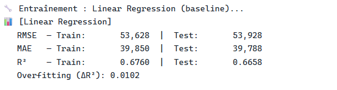

| Métrique | Train | Test |
|---|---|---|
| RMSE | 53 628 | 53 928 |
| MAE | 39 850 | 39 788 |
| R² | 0.6760 | 0.6658 |
| Overfitting (ΔR²) | — | **0.0102** ✅ |

#### Random Forest

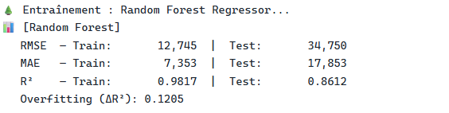

| Métrique | Train | Test |
|---|---|---|
| RMSE | 12 745 | 34 750 |
| MAE | 7 353 | 17 853 |
| R² | 0.9817 | 0.8612 |
| Overfitting (ΔR²) | — | **0.1205** ⚠️ |

#### XGBoost (base)

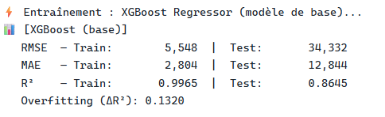

| Métrique | Train | Test |
|---|---|---|
| RMSE | 5 548 | 34 332 |
| MAE | 2 804 | 12 844 |
| R² | 0.9965 | 0.8645 |
| Overfitting (ΔR²) | — | **0.1320** ⚠️ |

---

### Étape 6 — Comparaison des 3 modèles (régression)

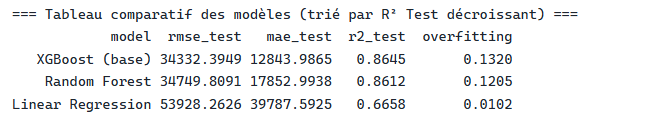

| Modèle | RMSE Test | MAE Test | R² Test | Overfitting |
|---|---|---|---|---|
| **XGBoost (base)** | **34 332** | **12 844** | **0.8645** | 0.1320 |
| Random Forest | 34 750 | 17 853 | 0.8612 | 0.1205 |
| Linear Regression | 53 928 | 39 788 | 0.6658 | 0.0102 |

#### Valeurs réelles vs prédites — graphique

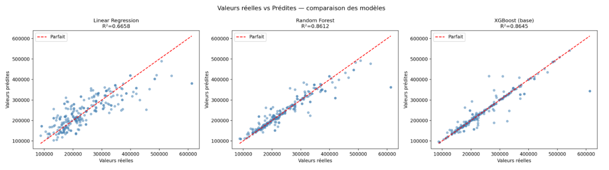

> XGBoost et Random Forest ont des nuages de points nettement plus resserrés autour de la droite idéale (R²≈0.86) que la Linear Regression (R²=0.67).

---

### Étape 6 — Métriques de classification (Accuracy, Precision, Recall)

> **Méthode :** Les prédictions continues sont binarisées selon le **prix médian (217 000)** comme seuil.  
> **Classe 1** = maison chère (≥ médiane) | **Classe 0** = maison abordable (< médiane)

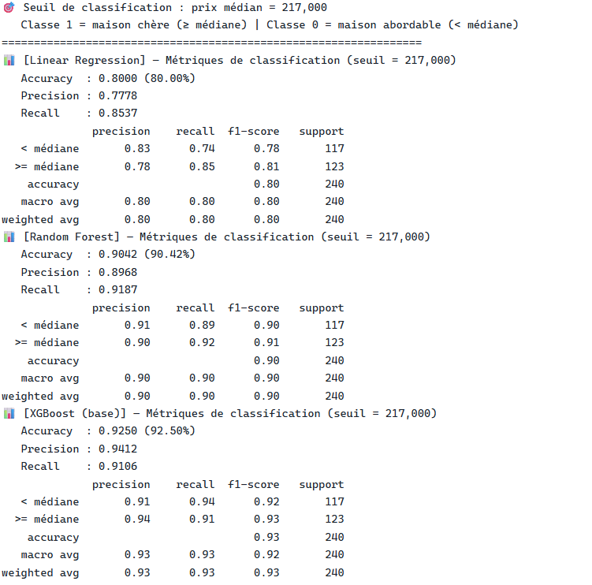

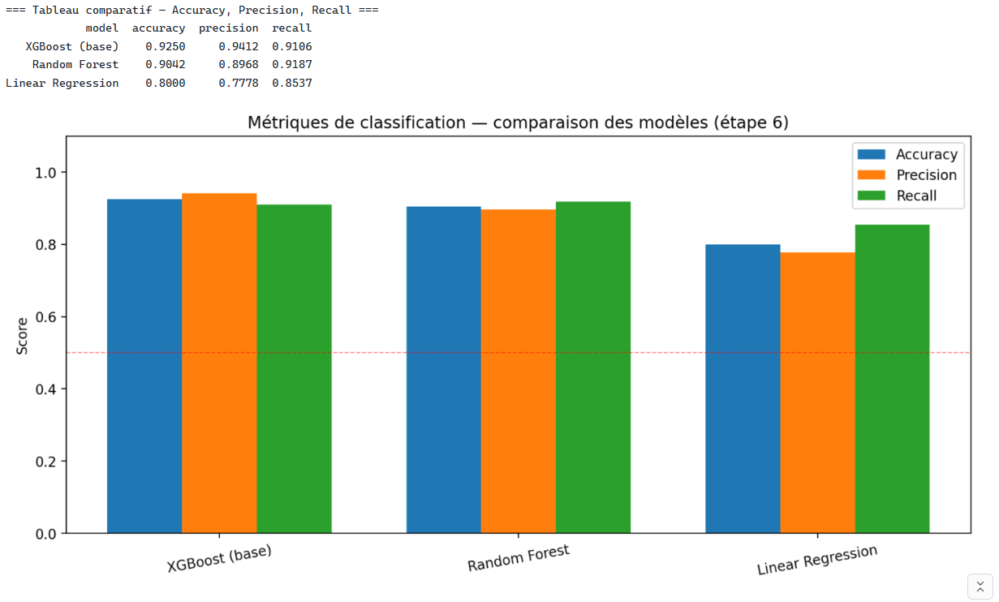

| Modèle | Accuracy | Precision | Recall |
|---|---|---|---|
| **XGBoost (base)** | **92.50%** | **0.9412** | **0.9106** |
| Random Forest | 90.42% | 0.8968 | 0.9187 |
| Linear Regression | 80.00% | 0.7778 | 0.8537 |

---

### Étape 7 — Optimisation par GridSearchCV

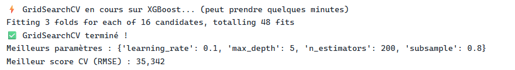

**Grille testée :** 16 combinaisons × 3-fold CV = 48 fits

| Paramètre | Valeurs testées | Valeur optimale |
|---|---|---|
| `n_estimators` | 100, 200 | **200** |
| `learning_rate` | 0.05, 0.1 | **0.1** |
| `max_depth` | 3, 5 | **5** |
| `subsample` | 0.8, 1.0 | **0.8** |

**Meilleur score CV (RMSE) : 35 342**

#### Heatmap GridSearchCV — RMSE par combinaison

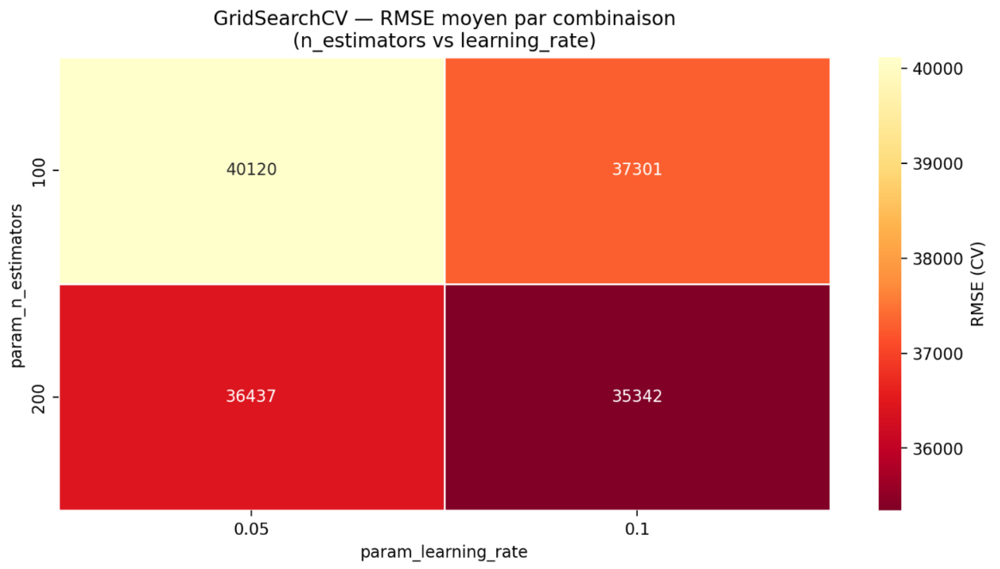

> La combinaison `n_estimators=200` + `learning_rate=0.1` donne le meilleur RMSE CV de **35 342**.

#### XGBoost optimisé — Résultats et classement final

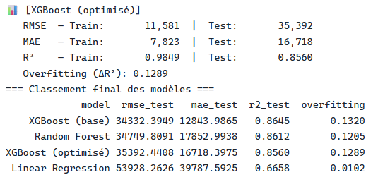

| Modèle | RMSE Test | MAE Test | R² Test | Overfitting |
|---|---|---|---|---|
| **XGBoost (base)** | **34 332** | **12 844** | **0.8645** | 0.1320 |
| Random Forest | 34 750 | 17 853 | 0.8612 | 0.1205 |
| XGBoost (optimisé) | 35 392 | 16 718 | 0.8560 | 0.1289 |
| Linear Regression | 53 928 | 39 788 | 0.6658 | 0.0102 |

#### Classement final — Accuracy, Precision, Recall (avec modèle optimisé)

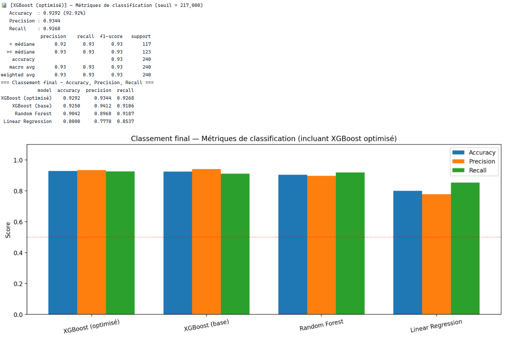

| Modèle | Accuracy | Precision | Recall |
|---|---|---|---|
| **XGBoost (optimisé)** | **92.92%** | **0.9344** | **0.9268** |
| XGBoost (base) | 92.50% | 0.9412 | 0.9106 |
| Random Forest | 90.42% | 0.8968 | 0.9187 |
| Linear Regression | 80.00% | 0.7778 | 0.8537 |

---

## 🏆 Meilleur modèle retenu

Le modèle retenu pour le **Snowflake Model Registry (V1)** est le **XGBoost optimisé** car :

- Meilleure **Accuracy de classification** : **92.92%**
- Meilleur **Recall** : **0.9268** — il manque très peu de maisons chères
- **Overfitting réduit** par rapport à XGBoost base (0.1289 vs 0.1320)
- **R² Test** de 0.856 — explique 85.6% de la variance des prix

> Bien que le XGBoost base ait un RMSE légèrement inférieur (34 332 vs 35 392), le modèle optimisé offre un meilleur équilibre entre précision de classification et généralisation.

---

## 📦 Livrables

- **Notebook Snowflake** : `notebooks/MBAESG_JANVIER_BDIA_EVALUATION_DATAENGINEER_MLOPS.ipynb`
- **Modèles enregistrés** : `HOUSE_PRICE_PREDICTION` — V0 (base) et V1 (optimisé) dans le Snowflake Model Registry
- **Table de prédictions** : `HOUSE_PRICE_PREDICTIONS` dans Snowflake
- **Application Streamlit** : Interface de prédiction interactive déployée dans Snowflake
- **Captures d'écran** : `images/` — résultats d'exécution complets
